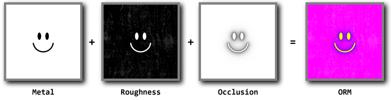

# ZIP Texture Loader

  

A Godot import plugin for loading ZIP archives as textures.

It can to combine several images from a ZIP archive into one texture resource. This allows you to, for example, maintain your metal, roughness and occlusion maps as separate files, but still load them as one texture.

It can handle all image formats that Godot has built-in support for: `.bmp`, `.png`, `.jpg`, `.svg`, `.webp`, `.tga`, `.dds` and `.ktx`.

## Installation
1. Download and drop the `Addons` directory into your Godot project directory.
2. Enable the import plugin under `Project` => `Project Settings...` => `Plugins` => `ZIP Texture Importer`.

## Usage
Any ZIP file in your resource folder can be imported as a `ZIP Texture`. In the importer, you can:
- Select the texture type (linear, sRGB or normal map).
- Select the compression type.
- Toggle mipmaps.
- Toggle premultiply alpha.
- For each channel:
  - Specify the source image file.
  - Select the source channel.
  - Invert the channel.

Several importer presets are available for importing common texture types, such as albedo, normal, metal, roughness, occlusion, ORM and emission.
